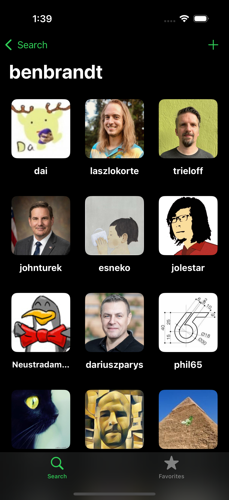
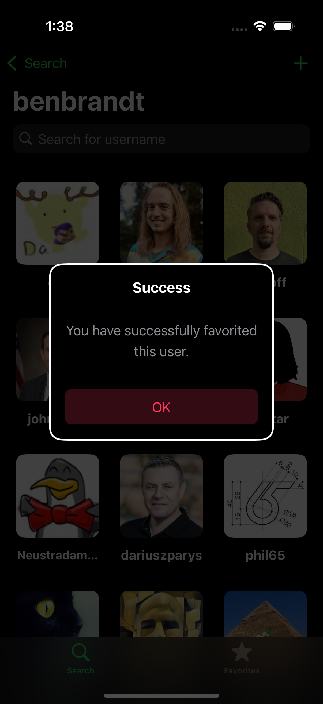
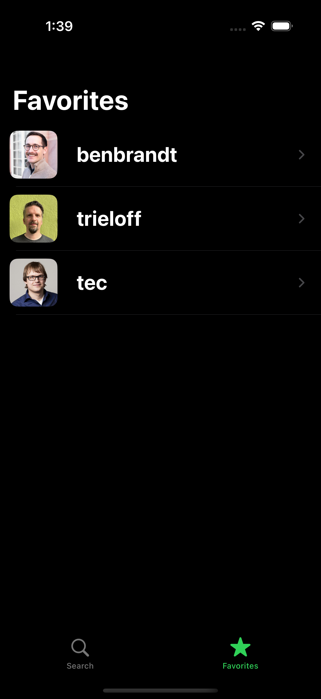
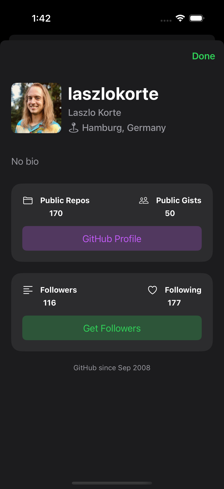

# GHFollowers

GHFollowers is a clean and intuitive **iOS application built in Swift** that allows users to search GitHub profiles, browse followers, manage favorites, and view detailed user information.  
The project focuses on **scalable architecture, reusable UI components, and best iOS development practices**.

---

## 📱 App Overview

GHFollowers helps users explore GitHub profiles by simply entering a username.  
Users can view followers, inspect profile details, and save favorite profiles for quick access — all with a smooth and native iOS experience.

---

## ✨ Key Features

- 🔍 Search GitHub users by username  
- 👥 View followers list with avatar and username  
- ⭐ Add and remove users from Favorites  
- 👤 View detailed user information:
  - Public repositories
  - Public gists
  - Followers & following count  
- 💾 Persist favorites using `UserDefaults`  
- 🌗 Supports Light & Dark Mode  
- 🔠 Dynamic Type support for accessibility  

---

## Screenshots

<table align="center">
  <tr>
    <td align="center">
       
      <b>Enter Username</b>
    </td>
    <td align="center">
       
      <b>Followers List</b>
    </td>
  </tr>
  <tr>
    <td align="center">
       
      <b>Add To favorites</b>
    </td>
    <td align="center">
       
      <b>Favorite List</b>
    </td>
  </tr>
   <tr>
    <td align="center">
       
      <b>Search User</b>
      </td>
    <td align="center">
       
      <b>User Detail</b>
    </td>
  </tr>
</table>

## 🛠️ Architecture & Technologies

- **Language:** Swift 5  
- **UI Framework:** UIKit (Programmatic UI)  
- **Architecture:** MVC  
- **Networking:**  
  - `URLSession`  
  - Generic `NetworkManager` for reusable API calls  
- **Persistence:**  
  - `UserDefaults` via `PersistenceManager`  
- **Custom UI Components:**  
  - `GFButton`  
  - `GFAvatarImageView`  
  - `GFTitleLabel`, `GFSecondaryTitleLabel`, etc.  
- **Utilities & Extensions:**  
  - `String+Ext`, `Date+Ext`, `UIView+Ext`  
  - `UIHelper` for layout calculations  
- **Error Handling:**  
  - Centralized `GFError` enum with user-friendly messages  

---
✅ Requirements

iOS 15.0+
Xcode 13.0+
Swift 5
